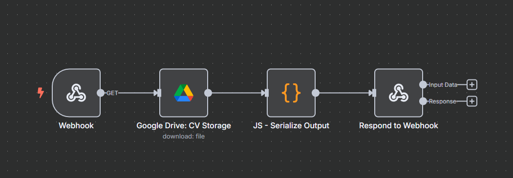

# Jose Hernandez Hoyos - Portfolio

My personal portfolio website built with modern web technologies, showcasing my experience as a Senior Software Developer. The site features a clean, responsive design with smooth animations and dark mode support.

## 🚀 Features

- Responsive design with modern UI/UX principles
- Dark/Light mode theme switching
- Smooth scroll animations using AOS
- Interactive components with GSAP animations
- Self-hosted automation workflows with n8n
- Projects section (🚧 In Progress)

## 🤖 Automated Features

### Contact Form Integration


I've implemented a fully automated contact system using a self-hosted n8n instance. Here's how it works:

1. **User Interaction**:
   - User fills out the contact form with their details
   - Client-side validation ensures all required fields are filled
   - Loading state provides visual feedback during submission

2. **Form Submission**:
   ```typescript
   const response = await fetch(contactWebhook, {
     method: "POST",
     headers: { "Content-Type": "application/json" },
     body: JSON.stringify(data)
   });
   ```

3. **n8n Workflow**:
   - Webhook receives the form data
   - Data is validated and sanitized
   - Contact information is stored in a database
   - Notification email is sent to me
   - Confirmation email is sent to the user
   - Success response is returned to the form

4. **User Feedback**:
   - Success message shown on successful submission
   - Error handling with user-friendly messages
   - Form resets for new submissions

### CV Download System



The CV download system is another automated workflow I've built with n8n:

1. **Download Request**:
   - User clicks the download CV button
   - Request is sent to n8n webhook
   - Loading state indicates processing

2. **n8n Processing**:
   - Webhook triggers the workflow
   - Latest CV version is retrieved from secure storage
   - Download analytics are recorded
   - Direct download link is generated


Both features demonstrate my approach to building secure, scalable, and user-friendly automation systems. The entire workflow is self-hosted, ensuring data privacy and complete control over the infrastructure.

## 💻 Technologies Used

- [Astro](https://astro.build/) - Static Site Generator
- [TailwindCSS](https://tailwindcss.com/) - Styling
- [TypeScript](https://www.typescriptlang.org/) - Type Safety
- [AOS](https://michalsnik.github.io/aos/) - Scroll Animations
- [GSAP](https://greensock.com/gsap/) - Advanced Animations
- [n8n](https://n8n.io/) - Workflow Automation
- [Inter](https://fonts.google.com/specimen/Inter) & [Playfair Display](https://fonts.google.com/specimen/Playfair+Display) - Typography

## 🛠️ Project Structure

```text
/
├── public/
│   ├── images/        # Static images and documentation
│   └── favicon.svg
├── src/
│   ├── assets/        # Component-specific assets
│   ├── components/    # Reusable UI components
│   ├── layouts/       # Page layouts
│   ├── pages/         # Route pages
│   └── styles/        # Global styles
└── package.json
```

## ⚙️ Development

```bash
# Install dependencies
pnpm install

# Start development server
pnpm dev

# Build for production
pnpm build

# Preview production build
pnpm preview
```

## 🔄 Current Status

The portfolio is actively being developed with most core features implemented. The Projects section is currently under construction and will be added soon with detailed showcases of my work.

## 📝 License

All rights reserved - Jose Hernandez Hoyos

## 🧞 Commands

All commands are run from the root of the project, from a terminal:

| Command                   | Action                                           |
| :------------------------ | :----------------------------------------------- |
| `npm install`             | Installs dependencies                            |
| `npm run dev`             | Starts local dev server at `localhost:4321`      |
| `npm run build`           | Build your production site to `./dist/`          |
| `npm run preview`         | Preview your build locally, before deploying     |
| `npm run astro ...`       | Run CLI commands like `astro add`, `astro check` |
| `npm run astro -- --help` | Get help using the Astro CLI                     |
